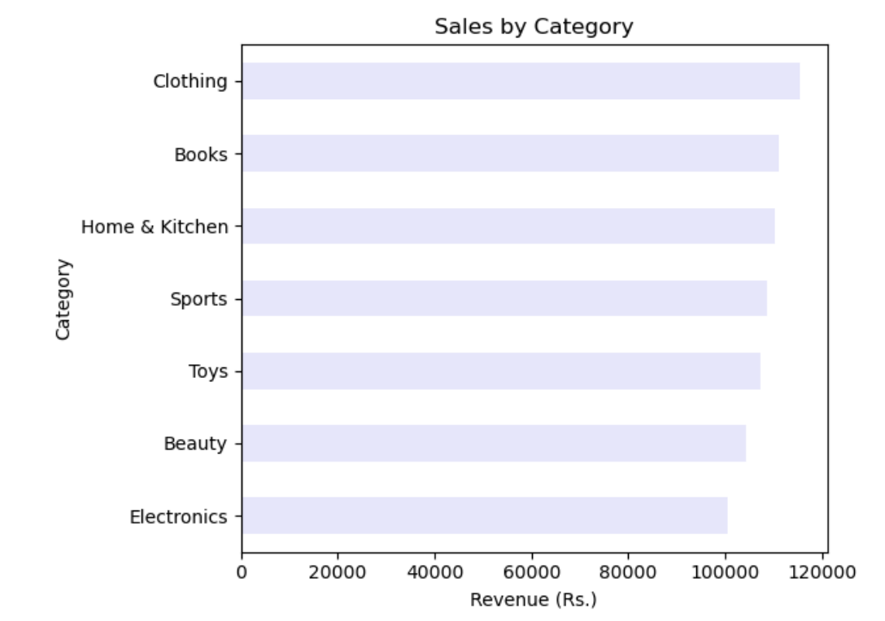
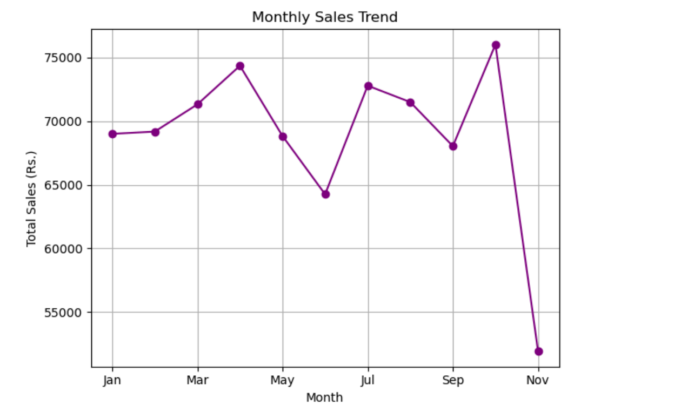
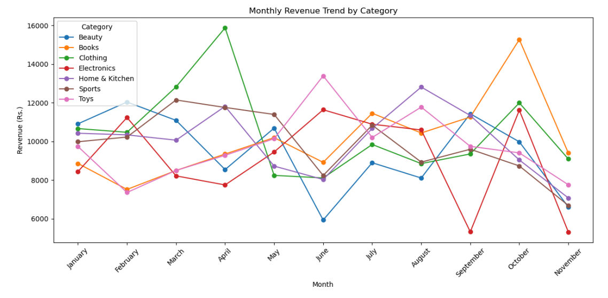

# 🛒 Customer Behavior Analysis

## 📌 Overview
This project explores customer purchasing behavior using an e-commerce dataset of **3,660 transactions**.  
The goal is to uncover **actionable business insights** related to sales trends, customer value, discounts, and payment preferences.

Instead of just visualizing data, this project focuses on **understanding customer decisions** and identifying patterns that businesses can use to improve revenue and strategy.

---

## 🚀 Key Insights
- 📈 Certain product categories dominate overall sales revenue  
- 💳 Payment methods influence customer spending behavior  
- 🎯 A small group of customers contributes a large portion of total sales (high-value customers)  
- 🏷️ Discounts do not always increase revenue; impact varies by category  
- 📅 Clear monthly and seasonal trends affect purchasing patterns  

---

## 📊 Analysis Performed
- Sales by Category  
- Monthly Sales Trends  
- Payment Method Analysis  
- Top Customers Identification  
- Discount Impact on Sales  
- Customer Segmentation  
- Product & Category Purchase Volume  
- Seasonal Category Trends  
- Payment Method vs Spending Behavior  
- Top Product Contribution  

---

## 🧰 Tech Stack
- **Python**
- **Pandas** – Data manipulation  
- **Matplotlib / Seaborn** – Data visualization  
- **Jupyter Notebook**

---

## 📂 Project Structure

```text
Customer-Behavior-Analysis
│
├── Customer_Behavior_Analysis.ipynb    # Main analysis notebook
├── Customer_Behavior_Analysis.pdf      # Clean report version
├── ecommerce_dataset.csv               # Dataset (3,660 rows)
├── images/                             # Sample visualization
└── README.md
```

---

## ⚙️ How to Run
1. Clone the repository  
   git clone <your_repo_url>

2. Open the notebook in Jupyter or VS Code  
3. Ensure the dataset is in the same directory  
4. Run all cells to reproduce the analysis  

---

## 📸 Sample Visualizations

### Sales by Category


### Monthly Sales Trend


### Monthly Revenue Trend


---

## 🎯 What I Learned
- Turning raw data into meaningful business insights  
- Identifying high-value customers and revenue drivers  
- Evaluating the real impact of discounts  
- Improving data storytelling through visualization  

---

## 💡 Future Improvements
- Build an interactive dashboard (Power BI / Tableau)  
- Apply machine learning for customer prediction  
- Automate reporting pipeline  

---

## 👤 Author
**Sadikshya Karki**
